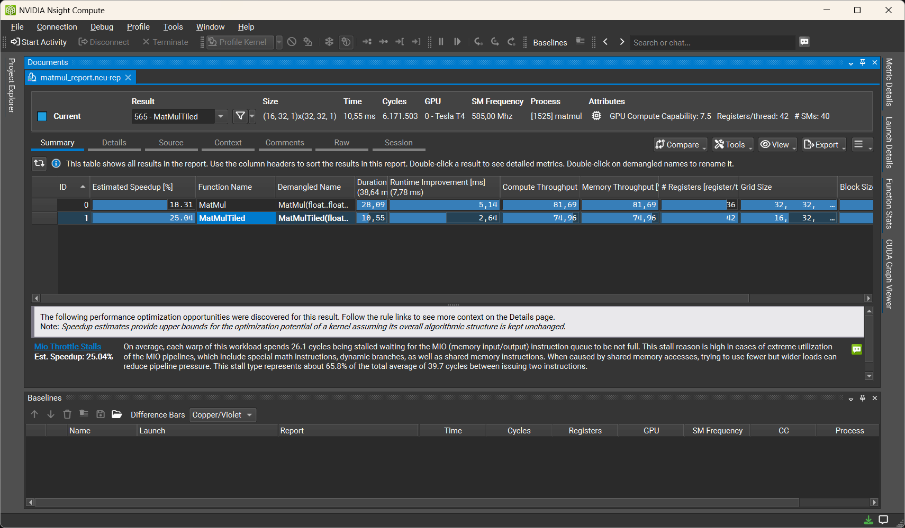
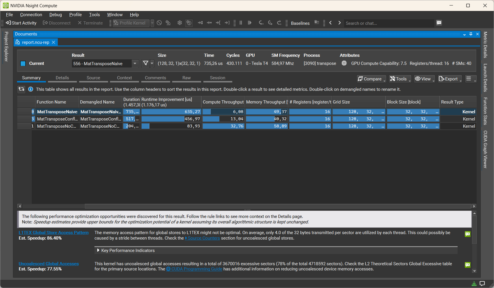
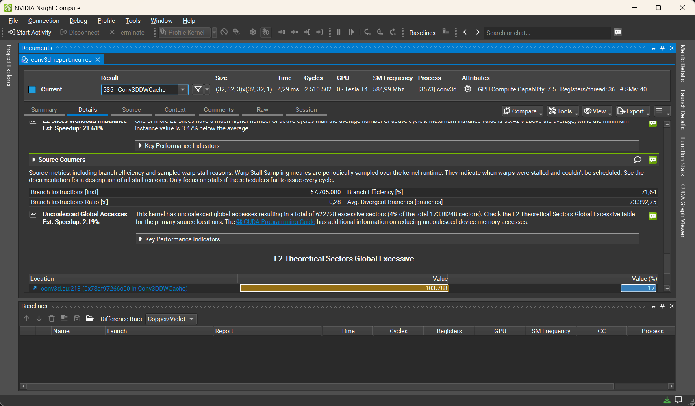

# CUDA from scratch

CUDA kernels implemented and profiled from scratch while working through
the PMPP ("Programming Massively Parallel Processors") book.

Every kernel is checked for correctness against a CPU reference and, where
relevant, profiled to verify the optimization it demonstrates.

## Kernels

| Kernel | Concept |
|---|---|
| VecAdd | basics: grid/block indexing, boundary guard |
| RGB2Gray | 2D indexing over an image |
| Blur | 2D stencil |
| MatMul | naive matrix multiply |
| TiledMatMul | shared-memory tiling |
| CoarsTiledMatMul | tiling + thread coarsening |
| CornerTurningMatMul | coalesced loads of a column-major matrix |
| MatTranspose | naive vs. shared-memory + bank-conflict-free |
| Convolution (1D/2D/3D) | naive vs. tiled with halo cells; constant memory for filters; 3D tiled variant is depthwise |

## Verification & profiling

Correctness: each kernel is diffed against a CPU implementation.
Performance: profiled with Nsight Compute on a Turing T4.

## Profiling Highlights

* **Naive vs. Tiled Matrix Multiplication**

Tiling gives about ~2x speedup over naive version because it reduces global memory traffic and keeps the reused data inside shared memory. However, because the shared memory is accessed frequently, each warp is being stalled most of the time waiting for MIO instruction queue to have space. Because of this, the full potential speedup isn't reached.
* **Shared Memory Bank Conflict**

Naive version is the slowest one because of uncoalesced write to output matrix. Tiled version reads input matrix in coalesced manner, but suffers from bank conflict when reading shared memory. Because all threads in a warp, in a single read instruction, read from the same bank (threads are moving along column of shared memory), this version suffers from 32-way bank conflict, forcing these reads to be performed sequentially. By padding shared memory, consecutive threads will hit different banks, allowing for parallel reading from shared memory. 
* **Branch Divergence**

Volumetric 3D convolution performs ~196K branch instructions, while 3D depthwise cached version performs ~67M. Main reason for this massive difference is `if/else` block inside two inner-most for loops, moving along kernel dimensions. Because branch efficiency is only ~71%, many of these branches diverge within a warp, so both paths execute one after another, which slows the kernel.
